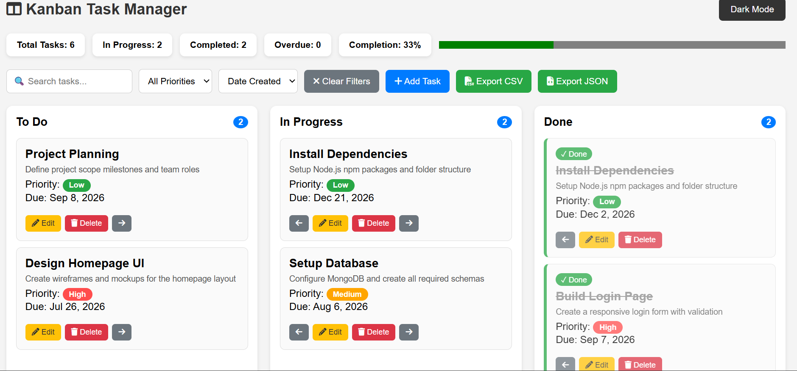
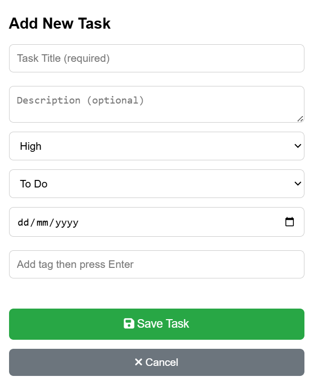

# Kanban Task Manager

A fully featured Kanban-style task management board built using pure HTML, CSS, and vanilla JavaScript. Tasks are saved in localStorage so everything persists across page reloads. No frameworks, no libraries — just clean vanilla code.

🔗 **Live Demo:** [your-github-username.github.io/task-manager-your-name](https://your-github-username.github.io/task-manager-your-name)
*(Replace this link with your real GitHub Pages link after deploying)*

📹 **Video Walkthrough:** [Watch on YouTube](https://youtube.com/your-video-link)
*(Replace this link with your real video link)*

---

## Screenshots

### Desktop Board

### Mobile Tab View

### Task Modal Open

---

## Features

- Add, edit, and delete tasks
- Three columns — To Do, In Progress, Done
- Move tasks left and right between columns using arrow buttons
- Drag and drop tasks between columns
- Priority badges — High (red), Medium (orange), Low (green)
- Tag pills — type a tag and press Enter to add, click × to remove
- Due date picker — past dates are blocked
- Overdue badge and red left border on overdue cards
- Done tasks get strikethrough title and green checkmark
- Description preview — first 60 characters shown on card
- Custom delete confirmation dialog — no browser alerts
- Search bar filters tasks across all three columns live
- Priority filter — All, High, Medium, Low
- Sort by Due Date, Priority, or Date Created
- All three filters work together simultaneously
- Clear Filters button resets everything
- Statistics bar — Total, In Progress, Completed, Overdue, Completion %
- Live progress bar showing completion percentage
- Overdue count shown in red when greater than zero
- Column task count badges update when filters are active
- LocalStorage persistence — full board restored on page reload
- Dark and Light mode toggle — saved to localStorage
- No flash of wrong theme on page load
- Responsive design — three columns on desktop
- Tab-based view on mobile — one column visible at a time
- Export tasks as CSV file
- Export tasks as JSON file
- Toast notifications for all actions
- Empty state messages when columns are empty
- Keyboard shortcuts — N opens new task modal, / focuses search, Escape closes modals

---

## Bonus Features

- Drag and drop using HTML5 Drag and Drop API
- Export to JSON with Blob URL download
- Keyboard shortcuts (N, /, Escape)

---

## Technologies Used

- HTML5
- CSS3
- Vanilla JavaScript (ES6)
- LocalStorage API
- HTML5 Drag and Drop API
- Font Awesome 6 (icons)

---

## Folder Structure

TASK-MANAGER-NAYYAB

├── index.html
├── css
│   ├── style.css
│   ├── dark-mode.css
│   └── animations.css
├── js
│   ├── app.js
│   ├── theme-init.js
│   ├── storage.js
│   ├── tasks.js
│   ├── board.js
│   ├── filters.js
│   ├── stats.js
│   ├── ui.js
│   └── tab.js
├── screenshots
│   ├── desktop.png
│   ├── mobile.png
│   └── modal.png
└── README.md