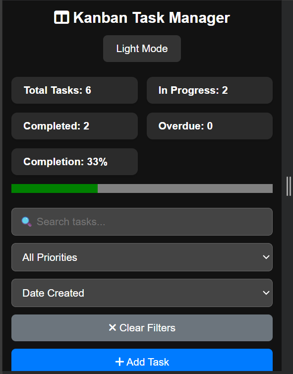
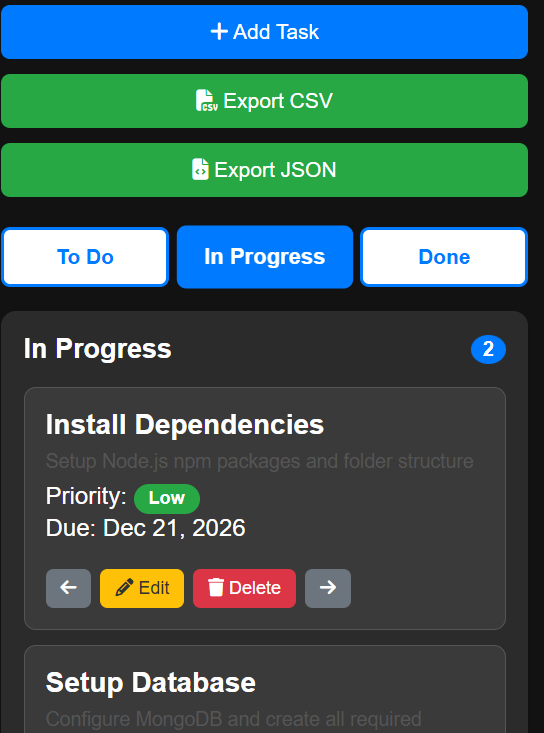
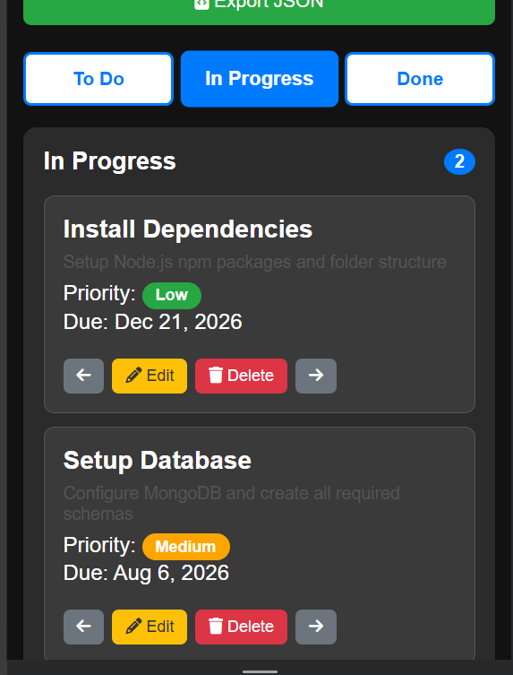

# Kanban Task Manager

A fully featured Kanban-style task management board built using pure HTML, CSS, and vanilla JavaScript. Tasks are saved in localStorage so everything persists across page reloads. No frameworks, no libraries — just clean vanilla code.

🔗 **Live Demo:** [your-github-username.github.io/task-manager-your-name](https://your-github-username.github.io/task-manager-your-name)
*(Replace this link with your real GitHub Pages link after deploying)*

📹 **Video Walkthrough:** [Watch on YouTube](https://youtube.com/your-video-link)
*(Replace this link with your real video link)*

---

## Screenshots

### Desktop Board


### Mobile Tab View




### Task Modal Open


---

## Features

- Add, edit, and delete tasks
- Three columns — To Do, In Progress, Done
- Move tasks left and right between columns using arrow buttons
- Drag and drop tasks between columns
- Priority badges — High (red), Medium (orange), Low (green)
- Tag pills — type a tag and press Enter to add, click × to remove
- Due date picker — past dates are blocked
- Overdue badge and red left border on overdue cards
- Done tasks get strikethrough title and green checkmark
- Description preview — first 60 characters shown on card
- Custom delete confirmation dialog — no browser alerts
- Search bar filters tasks across all three columns live
- Priority filter — All, High, Medium, Low
- Sort by Due Date, Priority, or Date Created
- All three filters work together simultaneously
- Clear Filters button resets everything
- Statistics bar — Total, In Progress, Completed, Overdue, Completion %
- Live progress bar showing completion percentage
- Overdue count shown in red when greater than zero
- Column task count badges update when filters are active
- LocalStorage persistence — full board restored on page reload
- Dark and Light mode toggle — saved to localStorage
- No flash of wrong theme on page load
- Responsive design — three columns on desktop
- Tab-based view on mobile — one column visible at a time
- Export tasks as CSV file
- Export tasks as JSON file
- Toast notifications for all actions
- Empty state messages when columns are empty
- Keyboard shortcuts — N opens new task modal, / focuses search, Escape closes modals

---

## Bonus Features

- Drag and drop using HTML5 Drag and Drop API
- Export to JSON with Blob URL download
- Keyboard shortcuts (N, /, Escape)

---

## Technologies Used

- HTML5
- CSS3
- Vanilla JavaScript (ES6)
- LocalStorage API
- HTML5 Drag and Drop API
- Font Awesome 6 (icons)

---

## Folder Structure

```
task-manager-nayyab/
├── index.html
├── css/
│   ├── style.css
│   ├── dark-mode.css
│   └── animations.css
├── js/
│   ├── app.js
│   ├── theme-init.js
│   ├── storage.js
│   ├── tasks.js
│   ├── board.js
│   ├── filters.js
│   ├── stats.js
│   ├── ui.js
│   └── tab.js
├── screenshots/
│   ├── desktop.png
│   ├── mobile1.png
│   ├── mobile2.png
│   ├── mobile3.png
│   └── modal.png
└── README.md
```

---

## How to Run Locally

1. Click the green **Code** button on this GitHub repository
2. Click **Download ZIP** and extract the folder
3. Open the extracted folder
4. Double click **index.html** to open it in your browser
5. Everything works locally — no server or installation needed

---

## Data Structure

Each task is stored as a JavaScript object inside an array in localStorage:

```javascript
const tasks = [
  {
    id: 1703001234567,        // Date.now() at creation time
    title: "Build login page", // Task title (min 3 chars)
    description: "Create a responsive login form with validation",
    priority: "High",          // "High" | "Medium" | "Low"
    status: "todo",            // "todo" | "progress" | "done"
    date: "2025-12-25",        // ISO date string YYYY-MM-DD
    tags: ["HTML", "CSS", "JS"], // Array of tag strings
    createdAt: 1703001234567   // Date.now() at creation time
  }
];

// Saving to localStorage:
localStorage.setItem("tasks", JSON.stringify(tasks));

// Reading from localStorage:
const tasks = JSON.parse(localStorage.getItem("tasks")) || [];
```

---

## What I Learned

Building this project was a great learning experience. The biggest challenge I faced was managing the tasks array as the single source of truth — every render, filter, sort, and stat had to come from the same array instead of reading from the DOM. I also learned how localStorage works with JSON.stringify and JSON.parse to save and restore complex data. Dark mode without a page flash was tricky — I solved it by running a tiny script in the head before the body renders. The filter, search, and sort system taught me how to chain .filter() and .sort() together cleanly. Overall this project made me much more confident with DOM manipulation, event handling, and organising JavaScript into separate files with clear responsibilities.